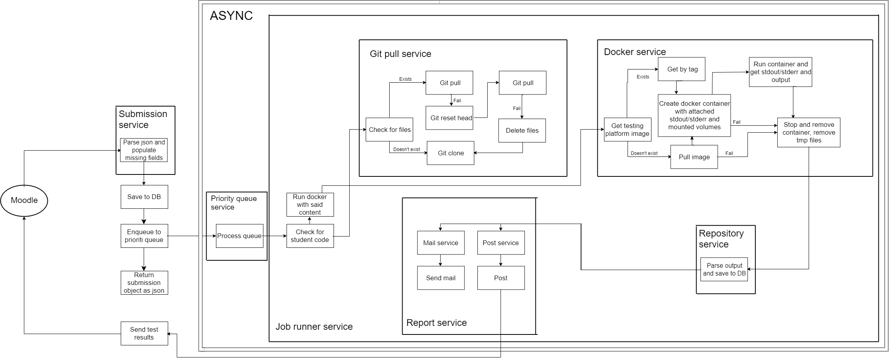
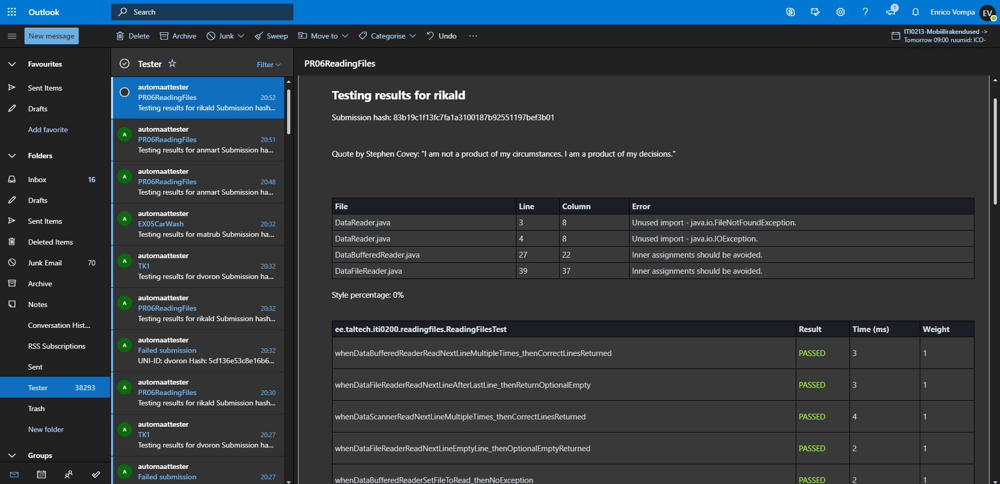
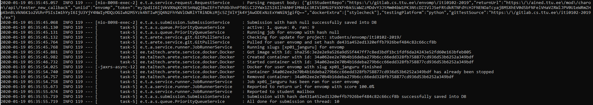
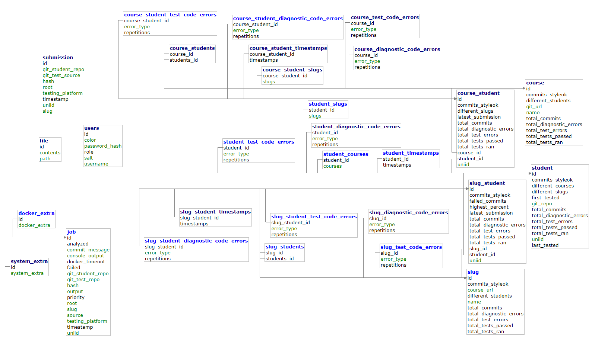

# Automated testing service

### System architecture


### Class diagram



### Mailed result 



### Workflow



### Database layout




Currently supported endpoints
----

Schemas can be generated from arete/api/data ```/request``` and ```/response```

* put
    * /image/{image}
    * /tests
* post
    * /:testAsync
    * /:testSync
    * /tests:update
    * /image/{image_name}:update
        * java-tester
        * python-tester
* get
    * /submissions/active
    * /logs
    * /state


Some useful curl commands
----
```shell script
Force an update on a test:
curl -d '{"project":{"url":"git@gitlab.cs.ttu.ee:iti0102-2019/ex.git","path_with_namespace":"iti0211-2019/ex"}}' -X POST -H "Content-Type: application/json" localhost:8098/tests:update

Force an update on a image
curl -X POST -H "Content-Type: application/json" localhost:8098/image/python-tester:update

Test something sync
curl -d '{"testingPlatform":"prolog","gitTestSource":"https://gitlab.cs.ttu.ee/iti0211-2019/tests","gitStudentRepo":"https://gitlab.cs.ttu.ee/envomp/iti0211-2019.git","uniid":"envomp"}' -X POST -H "Content-Type: application/json" localhost:8098/:testSync
```

Template to add to new test repositories as user manual:
----

````
If your exercise needs some extra features for testing, then add those to the root folder named arete.json or to the exercise folder namded arete.json as well.
Json in the root folder is applied to all subfolders.

Here is an example of an arete.json file:

{"dockerTimeout":120,"dockerExtra":["stylecheck"],"systemExtra":["noMail","noTesterFiles","noStd","noFeedback","minimalFeedback"]}
````

````
dockerTimeout - If testing the exercise takes longer than 120 seconds, then set the timeout to more suitable one.
````

dockerExtra: Sent to subtester. If you wish for details, check the subtester repository or consult the professor.

````
stylecheck - style control for python subtester
````

systemExtra:

````
anonymous - Nothing is saved to DB.

noOverride - dockerTimeout, dockerExtra ja systemExtra are not overwritten. (Request) or (Request < root) for the usual (Request < root < slug) respectively.

noMail - No mail is sent to student.

noFiles - No student nor tester files are returned from testing.

noTesterFiles - No tester files are returned from testing.

noStudentFiles - No student files are returned from testing.

noStd - No stdout nor stderr files are returned from testing.

noFeedback - Student doesn't see the exception what so ever. Only Failed.

minimalFeedback - Student doesn't see the exception message. Only Exception class.

noFun - Student doesn't see some fun features that might make them smile.
````


Getting Started
----

### Manual setup

##### Local docker with postgres ####

You need latest of: Docker

```shell script
git clone https://github.com/envomp/arete
docker login -u automatedtestingservice -p $DOCKER_PASSWORD
docker-compose up -d
```

##### Local host machine with H2 ####
You need latest of: Java11, Docker, System Environments for ARETE_HOME, GITLAB_PASSWORD
___
##### for Linux
```shell script
git clone https://gitlab.cs.ttu.ee/envomp/automated-testing-service
./mvnw clean install
java -jar -Dspring.config.location=src/main/resources/application-dev.properties target/arete-0.0.1-SNAPSHOT.jar
```

##### for Windows

```shell script
git clone https://gitlab.cs.ttu.ee/envomp/automated-testing-service
mvnw.cmd clean install
java -jar -Dspring.config.location=src/main/resources/application-dev.properties target/arete-0.0.1-SNAPSHOT.jar
```

#### Server
___
##### Shell config for dind

___
/etc/gitlab-runner/config.toml
```shell script
concurrent = 1
check_interval = 0

[session_server]
  session_timeout = 1800

[[runners]]
  name = "Shell"
  url = "https://gitlab.cs.ttu.ee/"
  token = "XXX"
  executor = "shell"
  [runners.custom_build_dir]
  [runners.cache]
    [runners.cache.s3]
    [runners.cache.gcs]
```
___
##### Virtualbox config

___
C:/gitlab-runner/config.toml
```shell script
concurrent = 1
check_interval = 0

[session_server]
  session_timeout = 1800

[[runners]]
  name = "VM-runner"
  url = "https://gitlab.cs.ttu.ee/"
  token = "XXX"
  executor = "virtualbox"
  [runners.custom_build_dir]
  [runners.ssh]
    host = "192.168.56.101"
    user = "envomp"
    password = "XXX"
    port = "22"
  [runners.virtualbox]
    base_name = "Server"
    disable_snapshots = false
  [runners.cache]
    [runners.cache.s3]
    [runners.cache.gcs]
```

run in terminal:
```shell script
./arete_local_install.sh
```

cleanup:
```shell script
./docker_cleanup.sh
```

Scripts have been tested on Ubuntu 18.04 and 19.04
